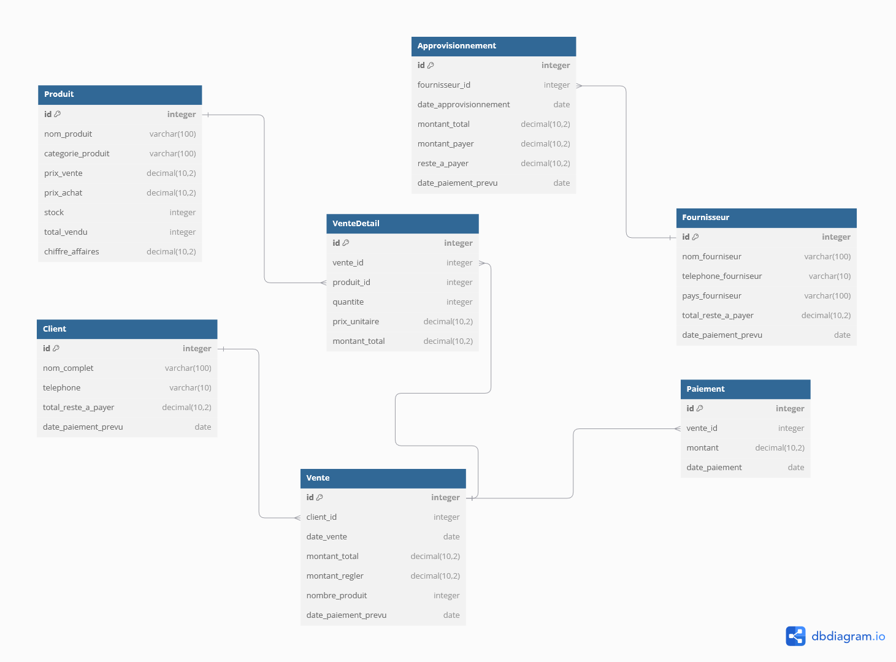

# KPH-Business-administration-Database-Designs

This project contains the database schema design for a business management system. It includes entities such as `Products`, `Suppliers`, `Clients`, and `Sales`, modeled to handle inventory, customer management, and sales transactions.

## Tools Used
- Designed with [dbdiagram.io]('https://dbdiagram.io/home')
- Database type Relational (SQL)

## Database Overview
- Produit Stores product details such as name, category, price, and stock information.
- Fournisseur Information about suppliers.
- Approvisionnement Manages supply orders from suppliers.
- Client Stores customer data.
- Vente Represents sales transactions with customers.

## Visual Schema

## MySQL Export
An SQL file is also available in the repository [Database SQL Script](KPH_admin_database_v2.sql`) to create this schema directly in a relational database.
